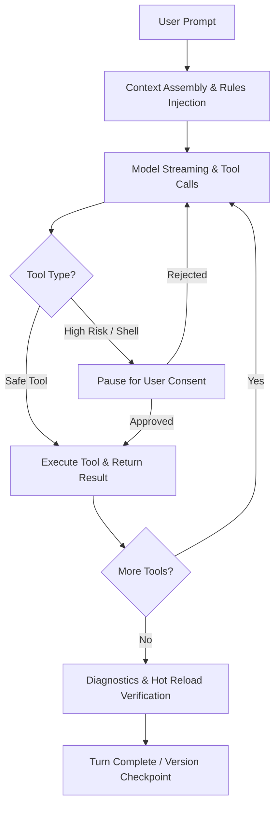

# Agent Modes & Turn Engine

Caide organizes agent behavior into three explicit operational modes. Each mode configures tool permissions, system prompt guidance, and execution boundaries.

---

## The Three Agent Modes

### 1. Build Mode (Default)

Build mode is Caide’s full autonomous pair-programming loop:

- **Full Tool Access**: File creation, multi-line diff replacement, AST searching, and shell execution.
- **Diagnostics Verification**: After modifying files, the turn runner inspects TypeScript compilation, lint warnings, and dev-server errors. If a build breaks, the agent automatically attempts targeted repairs.
- **Autonomous Multi-Step Turns**: Complex features are broken into iterative sub-steps. The agent proceeds through edits, reporting progress in the timeline.

### 2. Ask Mode (Read-Only)

When you need to investigate bugs, understand architecture, or brainstorm ideas without modifying files:

- **Read-Only Constraints**: File write, delete, and shell execution tools are strictly disabled.
- **Deep Code Search**: The agent uses ripgrep, AST symbol queries, and file readers to trace control flow and answer questions with exact file and line references.
- **Zero Risk**: Ideal for reviewing pull requests or exploring unfamiliar codebases without danger of accidental edits.

### 3. Plan Mode (Architectural Gating)

Plan mode focuses on structural planning and specification before touching disk:

- **App Blueprints**: Generates structured markdown specifications documenting route hierarchies, component trees, and data models.
- **3-Question Architecture Survey**: Solicits alignment on critical tradeoffs (e.g. database schema, auth provider, UI library).
- **Approval Gate**: Execution pauses until the user explicitly approves the blueprint or submits feedback.

---

## Turn Lifecycle & The Cancel Chain

A single turn follows a deterministic lifecycle:

### Cancel Chain Fidelity

If you click **Cancel Turn** while the agent is streaming or waiting for a tool:

1. Active LLM streaming sockets are terminated immediately.
2. In-flight background child processes (such as terminal commands) receive `SIGTERM` followed by `SIGKILL` if unresponsive.
3. The SQLite thread state records the exact cancellation envelope with `wasCancelled: true` and preserves tokens consumed up to that point.
4. Partial file modifications are cleanly rolled back to the previous Git checkpoint.
